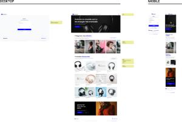
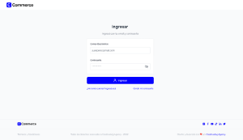
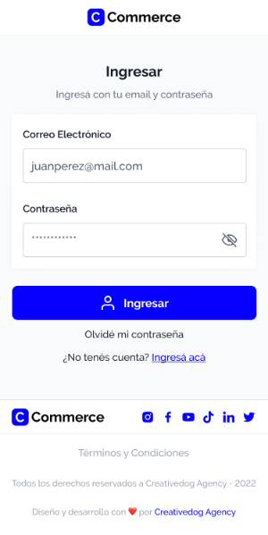

<p align="left">
    
</p>

# Prueba Técnica | [**Creativedog**](https://creativedog-insa.vercel.app/)

<p align="center">
  
</p>

<div align="center">

## **📌 TECNOLOGÍAS UTILIZADAS**


[](https://es.react.dev/)
[](https://nextjs.org/)
[](https://getbootstrap.com/)
[](https://swiperjs.com/)
[](https://formik.org/)
[](https://axios-http.com/)
[](https://vercel.com/)

</div>

---

<div align="center">

## **📋 DESCRIPCIÓN**

</div>

Este proyecto es el resultado de una prueba técnica desarrollada para **Creativedog Agency**, con el objetivo de evaluar habilidades en desarrollo frontend utilizando ReactJS y Next.js. La prueba consistió en la creación de dos pantallas: una de inicio de sesión y una de página principal simulando un entorno de comercio electrónico.

---

<div align="center">

## **📁 DETALLES**

</div>

**📍 LOGIN PAGE |** Una pantalla de inicio de sesión con las siguientes funcionalidades:

- Validación de formulario utilizando Formik.
- Manejo de errores en los campos del formulario.
- Proceso de autenticación llamando al endpoint correspondiente.
- Almacenamiento seguro de datos de sesión en Local Storage.

> [**IMPORANTE**]: el formulario de login está validado con yup.

**📍 HOME PAGE |** Una página principal responsiva que incluye:

- Diseño atractivo basado en el prototipo de Figma proporcionado.
- Integración de APIs para mostrar categorías de productos.
- Integración de APIs para obtener y mostrar productos de forma paginada.
- Contenido estático adicional según el diseño especificado.

---

<div align="center">

## **🎨 DISEÑOS**

</div>

<!-- <div style="display: flex; gap:2rem; justify-content: center; margin: 2rem;">
  <div style="align-content: center">
    <div style="display: flex; flex-direction: column; border: 1px solid #ddd; border-radius: 6px; padding: 10px; max-width: 400px; align-self: flex-start; margin-bottom: 2rem;">
      <div style="font-weight: bold; font-size: 1.25em; margin-bottom: 10px;">Figma (Files)</div>
      <div style="position: relative; overflow: hidden; border-radius: 6px; margin-bottom: 10px; max-height: 230px;">
        
      </div>
      <a href="https://www.figma.com/design/Y1agnin24G1Xuss788cleB/Prueba-T%C3%A9cnica---Frontend?node-id=1-3&p=f" target="_blank" style="text-decoration: none; color: #007bfc; font-size: 0.9em; display: flex; align-items: center;">
        
        <div>
          <div>Prueba Técnica - Frontend</div>
          <div style="color: #555; font-size: 0.8em;">Última modificación por Figma System • hace 1 mes</div>
        </div>
      </a>
    </div>
    <div style="display: flex; flex-direction: column; border: 1px solid #ddd; border-radius: 6px; padding: 10px; max-width: 400px; align-self: flex-start;">
      <div style="font-weight: bold; font-size: 1.25em; margin-bottom: 10px;">Figma (Prototypes) - Desktop</div>
      <div style="position: relative; overflow: hidden; border-radius: 6px; margin-bottom: 10px;">
        
      </div>
      <a href="https://www.figma.com/proto/Y1agnin24G1Xuss788cleB/Prueba-T%C3%A9cnica---Frontend?page-id=1%3A3&type=design&node-id=305-3526&scaling=scale-down-width&starting-point-node-id=305%3A3526&show-proto-sidebar=1&content-scaling=fixed" target="_blank" style="text-decoration: none; color: #007bfc; font-size: 0.9em; display: flex; align-items: center;">
        
        <div>
          <div>Prueba Técnica - Frontend</div>
          <div style="color: #555; font-size: 0.8em;">Última modificación por Figma System • hace 1 mes</div>
        </div>
      </a>
    </div>
  </div>
  <div>
    <div style="display: flex; flex-direction: column; border: 1px solid #ddd; border-radius: 6px; padding: 10px; max-width: 300px;">
      <div style="font-weight: bold; font-size: 1.25em; margin-bottom: 10px;">Figma (Prototypes) - Mobile</div>
      <div style="position: relative; overflow: hidden; border-radius: 6px; margin-bottom: 10px;">
        
      </div>
      <a href="https://www.figma.com/proto/Y1agnin24G1Xuss788cleB/Prueba-T%C3%A9cnica---Frontend?page-id=1%3A3&type=design&node-id=319-5294&scaling=scale-down-width&starting-point-node-id=319%3A5294&show-proto-sidebar=1&content-scaling=fixed" target="_blank" style="text-decoration: none; color: #007bfc; font-size: 0.9em; display: flex; align-items: center;">
        
        <div>
          <div>Prueba Técnica - Frontend</div>
          <div style="color: #555; font-size: 0.8em;">Última modificación por Figma System • hace 1 mes</div>
        </div>
      </a>
    </div>
  </div>
</div> -->
<table align="center">
    <td valign="center">
      <h3>Figma (Files)</h3>
      <a href="https://www.figma.com/design/Y1agnin24G1Xuss788cleB/Prueba-T%C3%A9cnica---Frontend?node-id=1-3&p=f" target="_blank">
        
        <p><strong>Prueba Técnica - Frontend</strong></p>
      </a>
      <sub>Última modificación por Figma System • hace 1 mes</sub>
      <hr>
      <h3>Figma (Prototypes) - Desktop</h3>
      <a href="https://www.figma.com/proto/Y1agnin24G1Xuss788cleB/Prueba-T%C3%A9cnica---Frontend?page-id=1%3A3&type=design&node-id=305-3526&scaling=scale-down-width&starting-point-node-id=305%3A3526&show-proto-sidebar=1&content-scaling=fixed" target="_blank">
        
        <p><strong>Prueba Técnica - Frontend</strong></p>
      </a>
      <sub>Última modificación por Figma System • hace 1 mes</sub>
    </td>
    <td width="100"></td>
    <td>
      <h3>Figma (Prototypes) - Mobile</h3>
      <a href="https://www.figma.com/proto/Y1agnin24G1Xuss788cleB/Prueba-T%C3%A9cnica---Frontend?page-id=1%3A3&type=design&node-id=319-5294&scaling=scale-down-width&starting-point-node-id=319%3A5294&show-proto-sidebar=1&content-scaling=fixed" target="_blank">
        
        <p><strong>Prueba Técnica - Frontend</strong></p>
      </a>
      <sub>Última modificación por Figma System • hace 1 mes</sub>
    </td>
</table>

---

<div align="center">

## **📖 RECURSOS UTILIZADOS**

</div>

<!-- <div style="margin: 2rem 0rem;">
  <div style="display: flex; justify-content: space-between;">
    <div>
      <strong>Documentación de la API</strong>
      <div style="display: flex; flex-direction: column; border: 1px solid #ddd; border-radius: 6px;padding: 10px; width: 48.1vw; align-self: flex-start; margin-bottom: 1.5rem; margin-top: 0.5rem;">
        <a href="https://app.theneo.io/creativedog/c-commerce/" target="_blank" style="text-decoration: none; font-size: 0.9em; display: flex; align-items: center;">
          
          <div>
            <div style="font-size: 14px; line-height: 20px; color: rgb(55, 53, 47); white-space: nowrap; overflow: hidden; text-overflow: ellipsis; min-height: 24px; margin-bottom: 2px;">app.theneo.io</div>
            <div style="font-size: 12px; line-height: 16px; color: rgb(55, 53, 47); white-space: nowrap; overflow: hidden; text-overflow: ellipsis;">https://app.theneo.io/creativedog/c-commerce/</div>
          </div>
        </a>
      </div>
    </div>
    <div style="display: flex; border: 1px solid #ddd; max-width: 338px; border-radius: 6px; align-self: flex-start;">
      <table>
        <thead>
          <tr>
            <th colspan=2 style="text-align: center">Usuario de prueba</th>
          </tr>
        </thead>
        <tbody>
          <tr>
            <td>identifier</td>
            <td>pruebatecnica@creativedog.agency</td>
          </tr>
          <tr>
            <td>password</td>
            <td>9I@5)22Jbc<{</td>
          </tr>
        </tbody>
      </table>
    </div>
  </div>
  <strong>Sistema de Diseño</strong>
  <div style="display: flex; flex-direction: column; border: 1px solid #ddd; border-radius: 6px; align-self: flex-start; max-width: 100vw; margin-bottom: 1.5rem; margin-top: 0.5rem;">
    <a href="https://bradfrost.com/blog/post/atomic-web-design/" target="_blank" style="text-decoration: none; font-size: 0.9em; display: flex; align-items: center;">
      <div style="padding: 10px;">
        <div style="font-size: 14px; line-height: 20px; color: rgb(55, 53, 47); white-space: nowrap; overflow: hidden; text-overflow: ellipsis; min-height: 24px; margin-bottom: 2px;">Atomic Design</div>
        <div style="font-size: 12px; line-height: 16px; color: rgba(55, 53, 47, 0.65); height: 32px; overflow: hidden;">Hey there! I wrote a book called Atomic Design that dives into this topic in more detail, which you can buy as an ebook. We’re not designing pages, we’re designing systems of components.—Stephen Hay As the craft of Web design continues to evolve, we're recognizing the need to develop thoughtful desi</div>
        <div style="display: flex; margin-top: 6px;">
          
          <div style="font-size: 12px; line-height: 16px; color: rgb(55, 53, 47); white-space: nowrap; overflow: hidden; text-overflow: ellipsis;">https://bradfrost.com/blog/post/atomic-web-design/</div>
        </div>
      </div>
      <div style="width: 100%; height: 106px;">
        
      </div>
    </a>
  </div>
  <strong>Guía de Estilo</strong>
  <div style="display: flex; flex-direction: column; border: 1px solid #ddd; border-radius: 6px; align-self: flex-start; max-width: 100vw; margin-top: 0.5rem;">
    <a href="https://airbnb.io/projects/javascript/" target="_blank" style="text-decoration: none; font-size: 0.9em; display: flex; align-items: center;">
      <div style="padding: 10px;">
        <div style="font-size: 14px; line-height: 20px; color: rgb(55, 53, 47); white-space: nowrap; overflow: hidden; text-overflow: ellipsis; min-height: 24px; margin-bottom: 2px;">Airbnb Engineering &amp; Data Science</div>
        <div style="font-size: 12px; line-height: 16px; color: rgba(55, 53, 47, 0.65); height: 32px; overflow: hidden;">Your first engineer is Picasso during his blue period. Your codebase quickly becomes filled with Picasso blue period javascript files. He paints you a javascript shopping cart without a problem. He's done it a million times before. But this is his best one. It's his masterpiece. And very blue.</div>
        <div style="display: flex; margin-top: 6px;">
          
          <div style="font-size: 12px; line-height: 16px; color: rgb(55, 53, 47); white-space: nowrap; overflow: hidden; text-overflow: ellipsis;">https://airbnb.io/projects/javascript/</div>
        </div>
      </div>
    </a>
  </div>
</div> -->
<table align="center">
    <td valign="center">
      <table>
        <thead>
          <tr>
            <th colspan=2><div align="center" >Documentación de la API</div></th>
          </tr>
        </thead>
        <tbody>
          <tr>
            <td rowspan=2 align="center" valign="center" >
              
            </td>
            <td>
              <b>app.theneo.io</b>
            </td>
          </tr>
          <tr>
            <td>
              <a href="https://app.theneo.io/creativedog/c-commerce/" target="_blank" >
                <sub>https://app.theneo.io/creativedog/c-commerce/</sub>
              </a>
            </td>
          </tr>
        </tbody>
      </table>
    </td>
    <td width="100"></td>
    <td>
      <table>
        <thead>
          <tr>
            <th colspan=2 style="text-align: center">Usuario de prueba</th>
          </tr>
        </thead>
        <tbody>
          <tr>
            <td>identifier</td>
            <td>pruebatecnica@creativedog.agency</td>
          </tr>
          <tr>
            <td>password</td>
            <td>9I@5)22Jbc<{</td>
          </tr>
        </tbody>
      </table>
    </td>
</table>
<hr>
<table>
  <thead>
    <tr>
      <th colspan=58 ><div align="center">Sistema de Diseño</div></th>
    </tr>
  </thead>
  <tbody>
    <tr>
      <td colspan=38 >Atomic Design</td>
      <td colspan=20 rowspan=3 ></td>
    </tr>
      <td colspan=38 >Hey there! I wrote a book called Atomic Design that dives into this topic in more detail, which you can buy as an ebook. We’re not designing pages, we’re designing systems of components.—Stephen Hay As the craft of Web design continues to evolve, we're recognizing the need to develop thoughtful desi...</td>
    <tr>
      <td colspan=1 width=16></td>
      <td colspan=37 align="left">
        <a href="https://bradfrost.com/blog/post/atomic-web-design/" target="_blank" >
          <sub>https://bradfrost.com/blog/post/atomic-web-design/</sub>
        </a>
      </td>
    </tr>
  </tbody>
</table>
<hr>
<table>
  <thead>
    <tr>
      <th colspan=58 ><div align="center">Guía de Estilo</div></th>
    </tr>
  </thead>
  <tbody>
    <tr>
      <td colspan=58 >Airbnb Engineering &amp; Data Science</td>
    </tr>
      <td colspan=58 >Your first engineer is Picasso during his blue period. Your codebase quickly becomes filled with Picasso blue period javascript files. He paints you a javascript shopping cart without a problem. He's done it a million times before. But this is his best one. It's his masterpiece. And very blue.</td>
    <tr>
      <td colspan=1 width=16></td>
      <td colspan=37 align="left">
        <a href="https://airbnb.io/projects/javascript/" target="_blank" >
          <sub>https://airbnb.io/projects/javascript/</sub>
        </a>
      </td>
    </tr>
  </tbody>
</table>

---

<div align="center">

## **🔀 ESTRUCTURA DEL PROYECTO**

</div>

### ✨ root (src)

- ***App.js***: Componente de React que renderiza las rutas y componentes.
- ***index.js***: Componente que contiene el render de **`App.js`** y los providers de los contexts.
- ***globalStyles.module.css***: Archivo que contiene los estilos generales de todo el documento.

### ✨ public > assets

- ***audios***: Archivos en formatos de audio.
- ***images***: Archivos en formatos de imagen.
- ***videos***: Archivos en formatos de video.

### ✨ components

- ***atoms***: Componentes de React más pequeños, la unidad mínima. Se suelen construir con elementos de HTML unicamente.
- ***molecules***: Componentes de React compuestos por dos o más átomos. Pueden contener algunos elementos HTML.
- ***organisms***: Componentes de React complejos, compuesto por moléculas. Puede contener átomos y algun elemento HTML auxiliar.
- ***templates***: Componentes de React más complejos, compuesto de organismos. Puede contener además alguna molécula. Funcionan como plantillas del contenido.

### ✨ contexts

- Archivos en formato **.js** que contienen Contexts de React utilizados en la aplicación.

### ✨ data

- Archivos en formato **.js** que tienen arrays y/u objetos con información estática de cada página.

### ✨ pages

- Archivos con componentes de las páginas del sitio. Renderizan su template del mismo nombre y contienen funciones que traigan la información correspondiente.

### ✨ utils

- Archivos en formato .js con funciones auxiliares útiles.

---

<div align="center">

## **⚙️ INSTALACIÓN Y USO**

</div>

1. **Clonar el repositorio:**

   ```bash
   git clone https://github.com/Insaurralde38/PT-Creativedog
   cd PT-Creativedog
   ```

2. **Instalar dependencias**:

    Asegúrate de tener **Node.js** y **npm** instalados en tu sistema. Luego, instala las dependencias de los archivos **`package.json`**.

   ```bash
   npm install
   ```

3. **Añadir variables de entorno**:

    En la carpeta raiz del proyecto deberás crear un archivo **`.env`** que tenga la siguiente forma:

   ```env
   NEXT_PUBLIC_API_BASE_URL=BaseURL
   ```

    Reemplazar **`BaseURL`** con la URL de la documentacion de la API. Este archivo no está incluido en este repositorio de github, ya que las credenciales son información sensible.

4. **Ejecutar proyecto**:

    Para visualizar la aplicación desde el navegador debes ejecutar el comando:

   ```bash
   npm run dev
   ```

    Ingresando a <http://localhost:3000> desde el navegador, podrás ver el proyecto en tiempo real

---

<div align="center">

## **⚠️ IMPORTANTE!**

</div>

Es necesario contar mínimamente con la última versión estable de **Node.js** y **npm**. Asegúrate de contar con ella para poder instalar correctamente las dependencias necesarias para correr el proyecto. Actualmente las versiones necesarias son:

-  **Node.js**: 12.18.3 o mayor
-  **npm**: 6.14.16 o mayor

Para verificar que versión tienes instalada:

   ```bash
   node -v
   npm -v
   ```

---

<div align="end">

Hecho con  por [**DIEGO INSAURRALDE**](https://insaurralde.vercel.app/) 

</div>